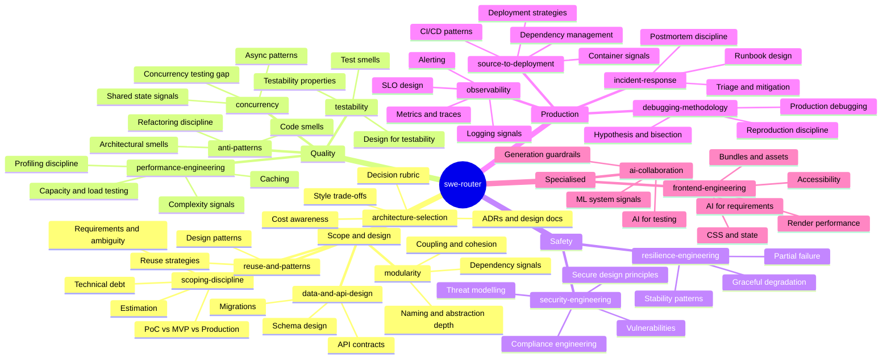

# SWE-Skill

A holistic software engineering skill set for AI agents. One router + seventeen focused domain skills covering the full idea-to-production lifecycle, from scoping through design, build, ship, operate, and respond to incidents. Built to ground agent reasoning, not prescribe procedures.

## How it works

The router (`swe-router`) auto-triggers on substantive SWE tasks and routes to the relevant domain skills. Domain skills load their bodies on demand — zero context cost for skills not needed on a given task.



## Skills

| Skill | Triggers on | Covers |
|---|---|---|
| `swe-router` | Any substantive SWE task | Routes to domain skills, anti-hallucination hard rules, the 70% problem |
| `scoping-discipline` | PoC, MVP, "just make it work", debt management, vague requirements, estimation | PoC/MVP/production requirements, debt quadrant, ambiguity decomposition, estimation |
| `architecture-selection` | Greenfield, monolith vs microservices, design doc, cost decision | Style trade-offs, decision rubric, ADRs, RFCs, cost awareness |
| `modularity` | Coupling, module boundaries, naming, abstraction quality | Coupling/cohesion types, dependency signals, deep vs. shallow modules, information hiding |
| `reuse-and-patterns` | Design patterns, library vs build, abstraction | GoF signal-based catalogue, reuse strategy trade-offs, patterns most often misapplied |
| `data-and-api-design` | Schema design, migrations, API endpoints, versioning | Expand/contract pattern, backward compatibility, idempotency, API versioning |
| `anti-patterns` | Code review, refactoring, legacy code | Code/architectural smells, refactor-under-test, Mikado method |
| `testability` | Hard to test, test design, testability review | Controllability/Observability/Isolation, test smells, seam identification |
| `performance-engineering` | Slow, optimise, latency, cache, load testing | Measure-first discipline, N+1/O(n²) signals, caching, load/stress/soak testing, capacity planning |
| `concurrency` | Async code, multi-threading, race conditions, non-deterministic failures | Race condition signals, async/await correctness, the concurrency testing gap |
| `security-engineering` | Auth, sensitive data, threat model, compliance | STRIDE, secure design principles, vulnerabilities, PII/audit/retention/encryption |
| `resilience-engineering` | External calls, cascading failures, retry logic | Timeout, retry+backoff+jitter, circuit breaker, graceful degradation, partial failure |
| `observability` | Production code, error handling, "can't debug this", SLOs | Structured logging, metrics vs traces, cardinality, four golden signals, SLO/error budget |
| `source-to-deployment` | CI/CD, deploy, Docker, IaC, dependency hygiene | Pipeline patterns, container signals, deployment strategies, supply chain management |
| `incident-response` | Production broken now, postmortem, runbook | Severity triage, mitigation vs fix, blameless postmortems, runbook design |
| `debugging-methodology` | Investigating any bug, fix not converging, prod-vs-local | Hypothesis loop, git bisect, reproduction discipline, production debugging |
| `frontend-engineering` | UI work, Core Web Vitals, bundle size, hydration, a11y | Render pipeline, bundle/asset delivery, CSS architecture, state, accessibility |
| `ai-collaboration` | AI-generated code, ML features, AI test review | Generation guardrails, AI test coverage gaps, ML system failure modes |

## What this skill set does NOT cover

These concerns are already handled by existing Claude Code commands and skills:

| Concern | Already covered by |
|---|---|
| Engineering process (understand → plan → implement → test → review → debug) | `/understand`, `/plan`, `/implement`, `/test`, `/review`, `/debug` commands |
| Requirements engineering | `/requirements-engineering` command |
| Issue and branch flow | `issue-branch-orchestrator` skill |
| Agent delegation decisions | `agent-orchestrator` skill |
| Project kickoff (rules, MCPs, repo structure) | `project-kickoff-orchestrator` skill |
| Code review process | `code-review:code-review` skill |
| Security code review checklist | `security-review` command |
| Code simplification | `simplify` skill |

Note: `debugging-methodology` and `/debug` are complementary — the command handles the process; the skill handles the judgment (hypothesis formation, bisection, reproduction).

## Installation

### Claude Code (personal, all projects)

```bash
cp -r .claude/skills/* ~/.claude/skills/
```

### Claude Code (project-specific)

The `.claude/skills/` directory is auto-discovered when present in the project root.

### Other agents (Cursor, Codex, OpenCode, Aider)

Multi-agent compatibility tracked in [issue #16](../../issues/16).

## Design principles

**Heuristic, not prescriptive.** Every domain skill is structured as: *signal* (how to detect) → *reasoning prompt* (what to ask) → *trade-off* (what to weigh) → *when to stop*. Not step-by-step procedures.

**Anti-hallucination guards are the only hard rules.** Verifying APIs exist, not inventing file paths, stating assumptions, the 70% problem (agents complete the happy path) — these stay deterministic. Technical domain judgment stays flexible.

**Progressive disclosure.** The router body loads once. Each domain skill body loads only when the task matches. Reference files within each skill load only if the specific concern arises. Most tasks touch 1-3 domain skills, not all 17.

**No duplication of existing skills.** Each skill's `description` field carves distinct, non-overlapping trigger territory from every other skill in the user's environment.

## Coverage summary

The skill set covers the full lifecycle:

- **Scope** — what to build and at what stage (scoping-discipline)
- **Design** — how to structure it (architecture-selection, modularity, reuse-and-patterns, data-and-api-design)
- **Build** — how to build it well (anti-patterns, testability, performance-engineering, concurrency)
- **Secure** — how to keep it safe and compliant (security-engineering, resilience-engineering)
- **Ship** — how to deliver it to production (source-to-deployment)
- **Operate** — how to keep it running (observability, incident-response, debugging-methodology)
- **Specialise** — frontend and AI-as-product specifics (frontend-engineering, ai-collaboration)
