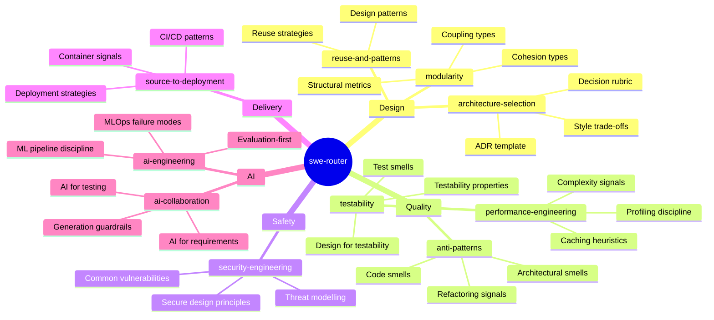

# SWE-Skill

A holistic software engineering skill set for AI agents. One router + ten focused domain skills, each covering a distinct technical concern. Built to ground agent reasoning, not prescribe procedures.

## How it works

The router (`swe-router`) auto-triggers on substantive SWE tasks and routes to the relevant domain skills. Domain skills load their bodies on demand — zero context cost for skills not needed on a given task.



## Skills

| Skill | Triggers on | Covers |
|---|---|---|
| `swe-router` | Any substantive SWE task | Routes to domain skills, anti-hallucination hard rules, stop conditions |
| `modularity` | Coupling, module boundaries, dependency review | Coupling types (Content→Data), cohesion types, CBO/RFC/Instability metrics |
| `anti-patterns` | Code review, refactoring, legacy code | Blob, Functional Decomposition, Golden Hammer, Design-by-Committee, Lava Flow |
| `reuse-and-patterns` | Design patterns, library vs build, abstraction | GoF patterns (signal-based), reuse strategy trade-offs |
| `testability` | Hard to test, test design, testability review | Controllability/Observability/Isolation, test smells, design-for-testability moves |
| `security-engineering` | Auth, sensitive data, threat model, access control | STRIDE reasoning prompts, secure design principles, vulnerability signals |
| `performance-engineering` | Slow, optimise, latency, cache, bottleneck | Measure-first discipline, N+1/O(n²) signals, caching trade-offs |
| `architecture-selection` | Greenfield, monolith vs microservices, architecture decision | Style trade-offs, context-based decision rubric, ADR template |
| `source-to-deployment` | CI/CD, deploy, Docker, IaC, release strategy | Pipeline patterns, container signals, blue-green/canary/rolling trade-offs |
| `ai-engineering` | ML model, training pipeline, MLOps, embeddings | ML pipeline discipline, eval-first, drift/reproducibility failure modes |
| `ai-collaboration` | AI-generated code, LLM for coding, AI-assisted workflow | Generation guardrails, AI test coverage gaps, AI-assisted RE gates |

## What this skill set does NOT cover

These concerns are already handled by existing Claude Code commands and skills — this set deliberately excludes them to avoid trigger overlap:

| Concern | Already covered by |
|---|---|
| Engineering process (understand → plan → implement → test → review → debug) | `/understand`, `/plan`, `/implement`, `/test`, `/review`, `/debug` commands |
| Requirements engineering | `/requirements-engineering` command |
| Issue and branch flow | `issue-branch-orchestrator` skill |
| Agent delegation decisions | `agent-orchestrator` skill |
| Idea to MVP scoping | `idea-to-project-planner` skill |
| Project kickoff (rules, MCPs, repo structure) | `project-kickoff-orchestrator` skill |
| Code review process | `code-review:code-review` skill |
| Security code review checklist | `security-review` command |
| Code simplification | `simplify` skill |

## Installation

### Claude Code (personal, all projects)

```bash
cp -r .claude/skills/* ~/.claude/skills/
```

### Claude Code (project-specific)

```bash
# From repo root — skills apply only in this project
cp -r .claude/skills .claude/skills
```

### Claude.ai

Zip the `.claude/skills/` directory and upload via Settings → Features → Custom Skills.

## Design principles

**Heuristic, not prescriptive.** Every domain skill is structured as: *signal* (how to detect) → *reasoning prompt* (what to ask) → *trade-off* (what to weigh) → *when to stop*. Not step-by-step procedures.

**Anti-hallucination guards are the only hard rules.** Verifying APIs exist, not inventing file paths, stating assumptions — these stay deterministic. Technical domain judgment stays flexible.

**Progressive disclosure.** The router body loads once (~300 lines). Each domain skill body loads only when the task matches. Reference files within each skill load only if the specific concern arises. Most tasks touch 1–2 domain skills, not all 10.

**No duplication of existing skills.** Each skill's `description` field is written to carve distinct, non-overlapping trigger territory from every other skill in the user's environment.

## Milestone

Active development tracked in milestone [v1 — Router + 10 Domain Skills](../../milestone/1). All work branches from `milestone/v1-foundation`.
