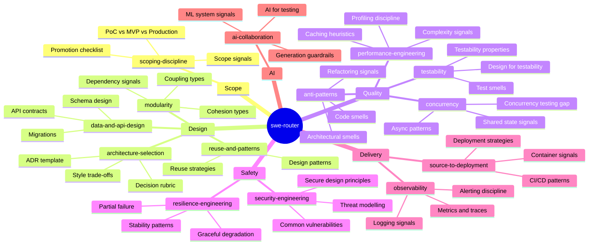

# SWE-Skill

A holistic software engineering skill set for AI agents. One router + fourteen focused domain skills covering the full idea-to-production lifecycle. Built to ground agent reasoning, not prescribe procedures.

## How it works

The router (`swe-router`) auto-triggers on substantive SWE tasks and routes to the relevant domain skills. Domain skills load their bodies on demand — zero context cost for skills not needed on a given task.



## Skills

| Skill | Triggers on | Covers |
|---|---|---|
| `swe-router` | Any substantive SWE task | Routes to domain skills, anti-hallucination hard rules, the 70% problem |
| `scoping-discipline` | PoC, MVP, "just make it work", promoting a prototype | PoC vs MVP vs production requirements, promotion checklist, scope signals |
| `modularity` | Coupling, module boundaries, dependency review | Coupling types (Content→Data), cohesion types, dependency signals, SOLID |
| `anti-patterns` | Code review, refactoring, legacy code | Blob, Functional Decomposition, Golden Hammer, Design-by-Committee, Lava Flow |
| `reuse-and-patterns` | Design patterns, library vs build, abstraction | GoF patterns (signal-based), reuse strategy trade-offs, patterns most often misapplied |
| `testability` | Hard to test, test design, testability review | Controllability/Observability/Isolation, test smells, design-for-testability moves |
| `security-engineering` | Auth, sensitive data, threat model, access control | STRIDE reasoning prompts, secure design principles, vulnerability signals |
| `performance-engineering` | Slow, optimise, latency, cache, bottleneck | Measure-first discipline, N+1/O(n²) signals, caching trade-offs |
| `concurrency` | Async code, multi-threading, race conditions, non-deterministic failures | Race condition signals, async/await correctness, the concurrency testing gap |
| `architecture-selection` | Greenfield, monolith vs microservices, architecture decision | Style trade-offs, context-based decision rubric, ADR template |
| `data-and-api-design` | Schema design, migrations, API endpoints, versioning | Expand/contract pattern, backward compatibility, idempotency, API versioning |
| `resilience-engineering` | External calls, cascading failures, retry logic, dependency failures | Timeout, retry+backoff+jitter, circuit breaker, graceful degradation, partial failure |
| `observability` | Production code, error handling, "can't debug this" | Structured logging, metrics vs traces, cardinality, four golden signals, alerting |
| `source-to-deployment` | CI/CD, deploy, Docker, IaC, release strategy | Pipeline patterns, container signals, blue-green/canary/rolling trade-offs |
| `ai-collaboration` | AI-generated code, LLM features, ML-as-product | Generation guardrails, AI test coverage gaps, ML system failure modes |

## What this skill set does NOT cover

These concerns are already handled by existing Claude Code commands and skills:

| Concern | Already covered by |
|---|---|
| Engineering process (understand → plan → implement → test → review → debug) | `/understand`, `/plan`, `/implement`, `/test`, `/review`, `/debug` commands |
| Requirements engineering | `/requirements-engineering` command |
| Issue and branch flow | `issue-branch-orchestrator` skill |
| Agent delegation decisions | `agent-orchestrator` skill |
| Project kickoff (rules, MCPs, repo structure) | `project-kickoff-orchestrator` skill |
| Code review process | `code-review:code-review` skill |
| Security code review checklist | `security-review` command |
| Code simplification | `simplify` skill |

## Installation

### Claude Code (personal, all projects)

```bash
cp -r .claude/skills/* ~/.claude/skills/
```

### Claude Code (project-specific)

The `.claude/skills/` directory is auto-discovered when present in the project root.

### Other agents (Cursor, Codex, OpenCode, Aider)

Multi-agent compatibility tracked in [issue #16](../../issues/16).

## Design principles

**Heuristic, not prescriptive.** Every domain skill is structured as: *signal* (how to detect) → *reasoning prompt* (what to ask) → *trade-off* (what to weigh) → *when to stop*. Not step-by-step procedures.

**Anti-hallucination guards are the only hard rules.** Verifying APIs exist, not inventing file paths, stating assumptions — these stay deterministic. Technical domain judgment stays flexible.

**Progressive disclosure.** The router body loads once. Each domain skill body loads only when the task matches. Reference files within each skill load only if the specific concern arises.

**No duplication of existing skills.** Each skill's `description` field carves distinct, non-overlapping trigger territory from every other skill in the user's environment.
